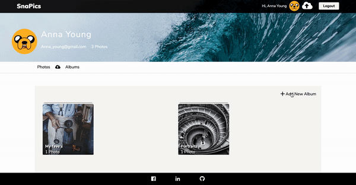
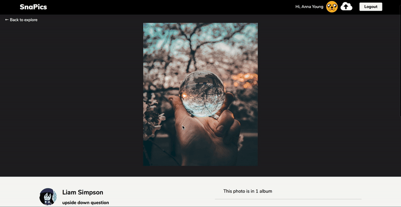

[SnaPics ](https://snap-pics.herokuapp.com/), is a Flickr inspired photo sharing application that allow the users to upload and share photos, create albums, and view other users profiles and photos.

## Technologies

* Ruby on Rails
* PostgreSQL
* React  
* Redux
* cloudinary
* Scss

[SnaPics Wiki page](https://github.com/roniRamon/snapics/wiki)


## Features
* Secure user authentication using BCrypt
* Logged in users can upload photos and view photos
* Users can create an album organize photos into the albums
* User can comment on photos
* User can add tags to the photo

#### Uploading a Photo
User can upload a photo by drag and drop or selecting a file, the photo visible in his profile page and from the home page.
when a user click on the upload button a modal with a form will allow the user to enter a title and a description and tp upload the photo.
User can change his profile image by going to his profile and clicking on the profile image.
The uploaded image is stored on cloudinary and the url to the image is stored in the application database once the form was submitted.

```javascript
handleSubmit(e) {
  e.preventDefault();
  let photo = {
    img_url: this.state.uploadedFileCloudinaryUrl,
    owner_id: this.state.ownerId,
    title: this.state.title,
    description: this.state.description,
  };
  this.props.createPhoto(photo).then(
    () => this.handleCloseModal()
  );
}
```
#### Albums
User can create new albums on their own profile.
When viewing their own album, users can add a photo to the album only if they are the owners of the album. If they are not, the upload button does not appear and they can only view the album.




#### Comments
When viewing a photo a user can add a comment to the photo and view other users comments. If the user is the owner of the comment he can remove it and a remove button will appear next to the comment.




#### Photo
 The photo container holds information about the
 photo - title and description and the owner of the image. The component is reused in different places in application. I am reusing the code in the home page user profile and displaying the photos in an album.

```javascript

export default ({ photo }) => (
  <div className="image-item-wrap">
    <Link to={`/photo/${photo.id}`}>
      <li>
          
          <p>{photo.title}</p>
          <p className="photo-username">
            <span className="photo-username-title">
              {photo.username}
            </span>
            <span>
              { photo.comments.length == 1 ?
                photo.comments.length + " Comment" :
                photo.comments.length + " Comments"
              }
            </span>
          </p>
      </li>
    </Link>
  </div>
);
```
